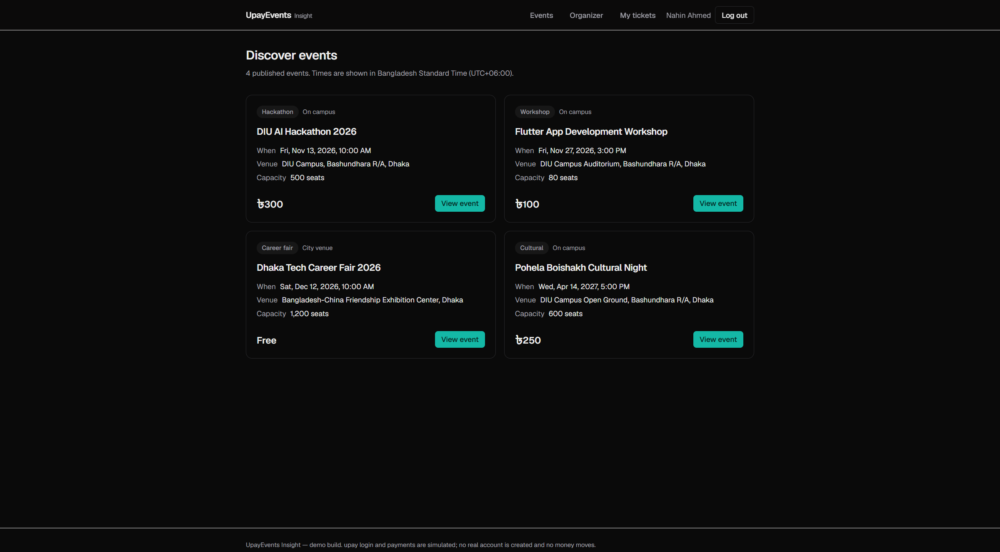
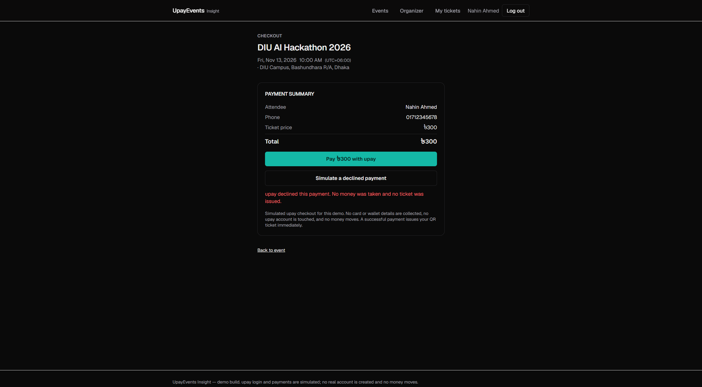
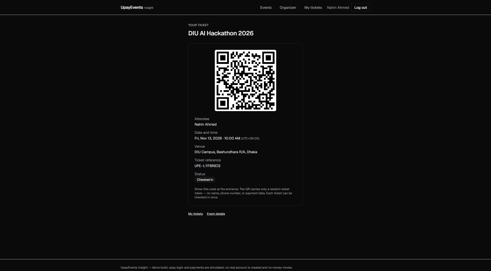
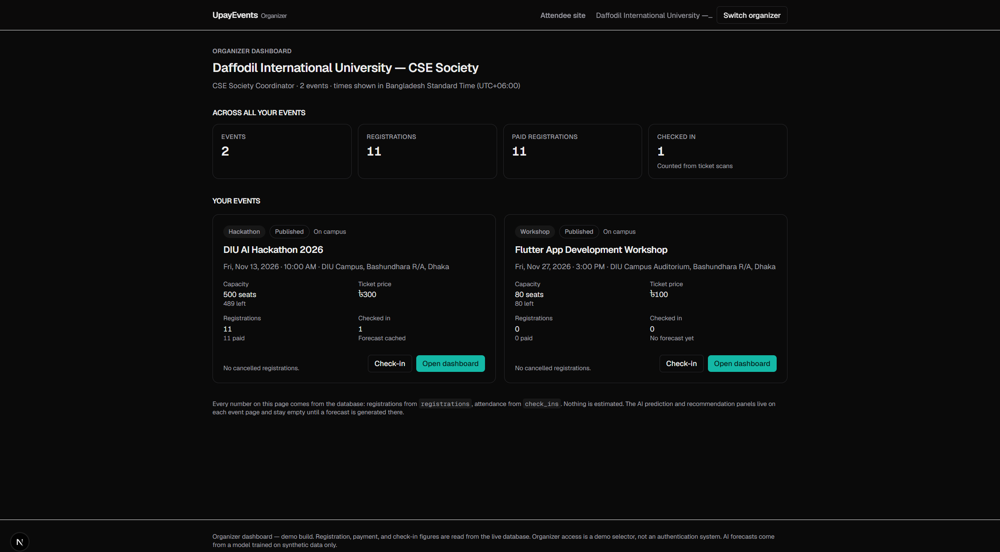
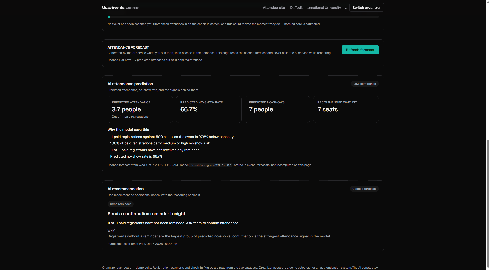
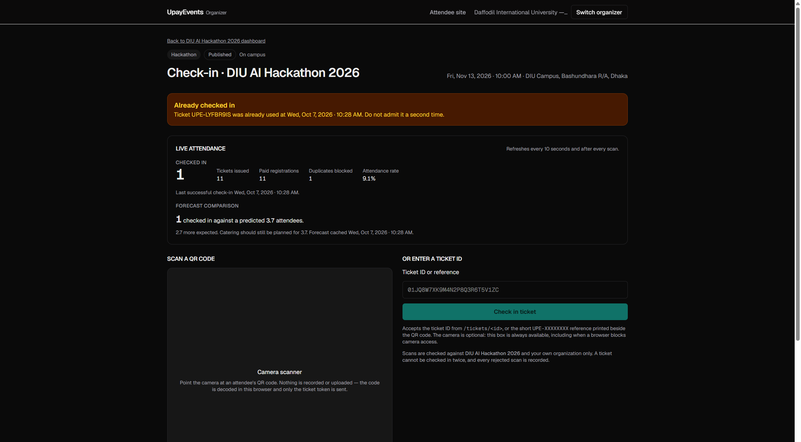
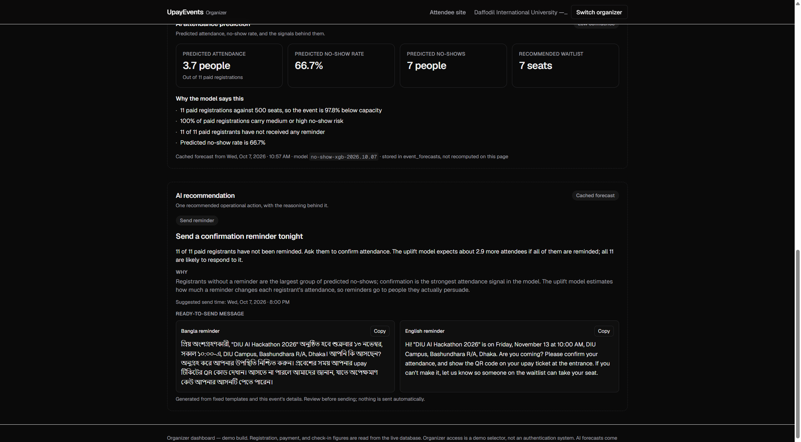
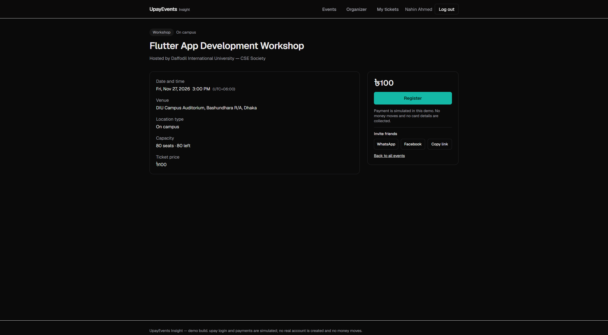
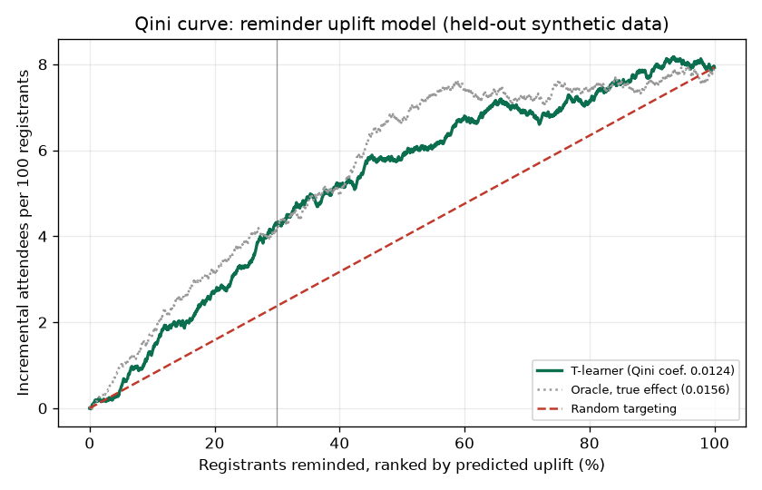

# UpayEvents Insight

An upay-linked event-registration platform for student events — hackathons,
workshops, cultural programs and career fairs — with AI attendance forecasting
for organizers.

> **Hackathon track:** Merchant & Agent Intelligence
> **Secondary tracks:** Growth & Campaign Intelligence · Trust & Risk Intelligence

| | |
| --- | --- |
| **Live deployment** | **`<LIVE_DEPLOYMENT_URL>`** ← replace before submission |
| **Repository** | https://github.com/toufiakhan19-hub/upay-events |
| **AI model and service code** | [`ai/`](ai/) — Python, FastAPI, XGBoost (see [`ai/README.md`](ai/README.md)) |
| **Product requirements** | [`docs/PRD.md`](docs/PRD.md) |
| **AI service contract** | [`docs/API_CONTRACT.md`](docs/API_CONTRACT.md) |

> **Demo disclaimer.** upay login and upay payment are **simulated**. No real
> upay API is called, no money moves, and no credentials are stored. All AI
> predictions come from a model trained on **synthetic data only**.

---

## Demo flow (3 minutes)

Follow these steps in order on the live site, or locally on
http://localhost:3000 with the AI service running (see
[§5](#5-installation-and-setup)). Each step says what to click and what you
should see.

**Attendee: register, pay, get a ticket**

1. Open the site and click **Log in**. Enter any name and an 11-digit phone
   number such as `01712345678`, then click **Continue with upay**.
2. Click **Events**. *You see four seeded events* ([screenshot 1](#screenshots)).
3. On **DIU AI Hackathon 2026**, click **View event**. *Under **Invite
   friends** you can share the event on WhatsApp or Facebook*
   ([screenshot 8](#screenshots)). Click **Register**.
4. On the checkout page, click **Simulate a declined payment**. *You see
   "upay declined this payment" and no ticket is issued* ([screenshot 2](#screenshots)).
5. Click **Pay ৳300 with upay**. *You land on your ticket: a QR code, a
   `UPE-XXXXXXXX` reference and status **Valid*** ([screenshot 3](#screenshots)).
   Write down the reference.
6. Optional: log out and repeat steps 1–5 with two or three other phone
   numbers, so the forecast has more paid registrations to work with.

**Organizer: AI forecast**

7. Click **Organizer** in the top bar, then **Open dashboard** next to
   **Daffodil International University — CSE Society**. *You see registration,
   paid and check-in totals across the organizer's events* ([screenshot 4](#screenshots)).
8. Click **Open dashboard** on **DIU AI Hackathon 2026**. *The registration
   metrics and funnel match what you just did.*
9. Scroll to **Attendance forecast** and click **Generate forecast**. *Within
   about a second you see predicted attendance, the predicted no-show rate,
   the recommended waitlist, a confidence label, plain-language reasons, and
   one recommended action such as "Send a confirmation reminder tonight"*
   ([screenshot 5](#screenshots)).
   *For a reminder, the recommendation also says how many extra attendees the
   uplift model expects, and shows ready-to-send Bangla and English messages
   with **Copy** buttons* ([screenshot 7](#screenshots)).

**Check-in staff: single-use tickets**

10. Click **Open the check-in screen** (near the top of the event dashboard).
11. Type the `UPE-XXXXXXXX` reference from step 5 into **Ticket ID or
    reference** and click **Check in ticket** (or click **Start camera** and
    show the QR). *You see **Checked in**, and the live count goes up by one.*
12. Click **Check in ticket** again with the same reference. *You see
    **Already checked in**, and the duplicate is blocked* ([screenshot 6](#screenshots)).
13. Back on the attendee side, **My tickets** now shows the ticket as
    **Checked in**.

---

## Screenshots

| | |
| --- | --- |
| **1. Event discovery** (`/events`)  | **2. Checkout with a declined payment**  |
| **3. QR ticket, after check-in** (`/tickets/[id]`)  | **4. Organizer overview** (`/organizer`)  |
| **5. AI forecast and recommendation** (`/organizer/events/[id]`)  | **6. Check-in, duplicate scan blocked** (`/organizer/events/[id]/checkin`)  |
| **7. Reminder uplift and Bangla/English messages**  | **8. Invite friends on WhatsApp or Facebook** (`/events/[slug]`)  |

Screenshot 5 shows a forecast generated by the real model for 11 paid
registrations. Every registrant has a synthetic prior-attendance count of 0
and none has been reminded yet, so the model predicts a high no-show rate and
recommends a reminder.

---

## Table of contents

- [Demo flow (3 minutes)](#demo-flow-3-minutes)
- [Screenshots](#screenshots)
- [Team](#team)

1. [Project overview](#1-project-overview)
2. [Features](#2-features)
3. [Technology stack](#3-technology-stack)
4. [Requirements](#4-requirements)
5. [Installation and setup](#5-installation-and-setup)
6. [Environment variables](#6-environment-variables)
7. [Run and build commands](#7-run-and-build-commands)
8. [Live deployment](#8-live-deployment)
9. [Testing and verification](#9-testing-and-verification)
10. [Other configuration](#10-other-configuration)
11. [Architecture](#11-architecture)
12. [Responsible AI and security](#12-responsible-ai-and-security)
13. [Limitations and roadmap](#13-limitations-and-roadmap)

---

## 1. Project overview

### Problem

Student-event organizers know how many people **registered**, but not how many
will **show up**. That gap causes empty seats, wasted food, T-shirts and venue
budget, promotion that starts too late, manual ticket checking with
duplicate-ticket risk, and a registration-plus-payment experience split across
several tools.

### Solution

UpayEvents treats event organizers as upay merchants and gives them one place
to:

- let existing upay users register and pay for an event in a few taps;
- issue a secure QR ticket only after a successful payment;
- check attendees in at the door, with duplicate scans rejected;
- see an **AI forecast** of real attendance and no-shows, with **one concrete
  recommended action** (for example "Open 13 waitlist slots" or "Plan catering
  for 210 attendees, not all 300 registrations").

### Purpose

Make upay the trusted payment and intelligence layer for Bangladesh's
student-event ecosystem:

- **Organizers** plan for the people who will actually attend.
- **Attendees** get simple discovery, one-tap payment and a secure ticket.
- **upay** gains legitimate payment use cases, merchant acquisition and repeat
  transactions.

---

## 2. Features

### Attendee

| Feature | Route |
| --- | --- |
| Mock **"Continue with upay"** login — name and phone only, no password | `/login` |
| Event discovery: category, date, venue, price, seats left | `/events` |
| Event detail page and one-click registration | `/events/[slug]` |
| **Invite friends**: share the event on WhatsApp or Facebook, or copy the link | `/events/[slug]` |
| Mock upay checkout with **success** and **declined** outcomes | `/events/[slug]/checkout` |
| Simulated transaction ID on success; no ticket on failure | checkout |
| Secure QR ticket and ticket status (valid / checked in / invalid) | `/tickets`, `/tickets/[id]` |

### Organizer

| Feature | Route |
| --- | --- |
| Demo organizer picker (choose an organization to act as) | `/organizer` |
| Event overview: registrations, paid registrations, awaiting payment | `/organizer` |
| Registration and payment funnel | `/organizer/events/[id]` |
| **AI forecast panel**: predicted attendance, predicted no-show rate, recommended waitlist, confidence, top reasons, one recommended action | `/organizer/events/[id]` |
| Explicit **Generate / Refresh forecast** button | `/organizer/events/[id]` |
| **Reminder uplift**: how many extra attendees a reminder is expected to bring, and who to remind first | `/organizer/events/[id]` |
| **Ready-to-send Bangla and English messages** for the recommended reminder or announcement, with copy buttons | `/organizer/events/[id]` |
| Live check-in count and forecast-versus-actual comparison | `/organizer/events/[id]/checkin` |

### Check-in staff

| Feature | Route |
| --- | --- |
| Camera QR scanner (in-browser, `jsQR`) | `/organizer/events/[id]/checkin` |
| Manual fallback: type the `UPE-XXXXXXXX` reference printed on the ticket | same |
| Each ticket validates **once**; results are `checked_in`, `already_used` or `invalid_ticket` | same |
| Check-in timestamp recorded; live attendance updates | same |

### How the AI is used

The central prediction is: **"Will this paid registrant attend the event?"**

1. When the organizer clicks **Generate forecast**, the app collects every paid,
   non-cancelled registration for the event and converts each into ten
   non-personal features (`src/server/ai/features.ts`):
   event category, ticket price, days before the event the person registered,
   payment delay in hours, event day of week, event start hour, location type
   (campus / city / online), reminder status, synthetic prior-attendance count,
   and cancellation flag.
2. The batch is sent in **one** request to the Python AI service
   (`POST /predict/forecast`), with a 3-second budget and one retry
   (`src/server/ai/client.ts`).
3. The AI service ([`ai/`](ai/)) scores each registration with an XGBoost
   no-show classifier, sums the individual attendance probabilities into an
   event-level forecast (`ai/app/forecast.py`), and applies recommendation
   rules to choose **exactly one** action: `open_waitlist`, `send_reminder`,
   `adjust_catering`, `target_segment`, `increase_capacity` or `no_action`.
   When the action is a reminder, a second model, the **reminder uplift
   model**, estimates how many extra attendees the reminder will bring and
   which registrants it will actually persuade.
4. The app **validates** the response against the contract before saving
   anything (`src/server/ai/validate.ts`) — wrong arithmetic, out-of-range
   values or missing explanations are rejected.
5. The validated forecast is stored in `event_forecasts`. The dashboard only
   ever reads this cache, so pages render even when the AI service is down.

Every forecast shows plain-language reasons (for example "41.7% of paid
registrations carry medium or high no-show risk"), generated from the actual
registrations being scored. No LLM is involved; every number comes from the
model. Predictions are advisory and never block a registration, payment or
check-in.

### The AI model

All model code is in this repository under [`ai/`](ai/):

| File | What it does |
| --- | --- |
| `ai/train/generate_data.py` | Generates 3,000 synthetic registrations with realistic attendance patterns (reminders, prior attendance, registration timing, payment delay, free vs. paid, online vs. in person, weekend). |
| `ai/train/train_model.py` | Trains the XGBoost no-show classifier on an 80/20 stratified split and writes the measured held-out metrics, including calibration, to `ai/artifacts/metrics.json`. |
| `ai/train/train_uplift.py` | Simulates a randomized reminder experiment, trains the two-model uplift learner, and evaluates it with a Qini curve and AUUC (`ai/artifacts/uplift_metrics.json`, `docs/images/qini-curve.png`). |
| `ai/app/features.py` | The one feature encoder, shared by training and inference so they cannot drift apart. |
| `ai/app/forecast.py` | Scoring, the event-level arithmetic from contract §2.2, plain-language reasons, the uplift estimate, and the recommendation rules. |
| `ai/app/main.py` | FastAPI app: `/health`, `/model-info`, `/predict/attendance`, `/predict/forecast`, plus one monitoring log line per prediction. |
| `ai/tests/test_contract.py` | Contract and uplift tests (see [§9.5](#95-ai-service-tests)). |
| `ai/tests/loadtest.py` | Concurrent load test (see [§9.6](#96-load-test)). |

**No-show model.** Measured on the held-out synthetic test set (600 rows):

| Metric | Value |
| --- | --- |
| ROC-AUC | **0.785** (target ≥ 0.75) |
| Accuracy | 0.698 |
| Precision / recall (attends) | 0.661 / 0.688 |
| Brier score | 0.189 |
| Expected calibration error | 0.060 |

The most important signals are reminder status, cancellation, event category,
location type and prior attendance. `GET /model-info` serves these numbers
along with the synthetic-data disclaimer and limitations.

**Reminder uplift model (marketing).** A no-show model says *who* is likely to
miss the event, but not *whether a reminder would change that*. Some people
come anyway, and some won't come whatever you send. The uplift model answers
the marketing question directly: "whose attendance does a reminder actually
change?"

- **Method:** a two-model T-learner. One XGBoost classifier is trained on
  registrants who were reminded and one on registrants who were not. A
  registrant's predicted uplift is P(attend | reminded) − P(attend | not
  reminded).
- **Data:** a simulated randomized experiment. 7,338 synthetic registrants are
  randomly assigned to get a reminder or not. The true effect varies by person:
  it is largest for early registrants who forget, first-timers and online
  attendees, and smallest for loyal regulars. Because the data is synthetic,
  the true effect is known, so the model can be checked against it.
- **Validation:** Qini curve and AUUC on a held-out 30% split (2,202 rows):

| Metric | Value |
| --- | --- |
| Qini coefficient (higher is better; random targeting = 0) | **0.0124** |
| Qini coefficient of a perfect model that knows the true effect | 0.0156 (the T-learner reaches 80% of it) |
| AUUC, model vs. random targeting | **0.103** vs. 0.079 |
| Share of all extra attendees gained by reminding only the top 30% | **54%** |
| Rank correlation with the true effect (Spearman) | 0.773 |



On the dashboard, when the recommendation is to send a reminder, the detail
line reads, for example, "The uplift model expects about 2.9 more attendees if
all of them are reminded; all 11 are likely to respond to it." When only some
registrants are persuadable, it says how many to remind first.

---

## 3. Technology stack

| Layer | Technology |
| --- | --- |
| Language | TypeScript 5 (web app), Python 3 (AI service) |
| Framework | Next.js 16 (App Router, Server Components, Server Actions), React 19 |
| Styling | Tailwind CSS v4 |
| Database | PostgreSQL on [Supabase](https://supabase.com), via the `postgres` driver |
| ORM / migrations | Drizzle ORM, Drizzle Kit |
| QR generation | `qrcode` |
| QR scanning | `jsqr` (in-browser camera decoding) |
| Auth | Mocked upay sign-in with HTTP-only session cookie (no third-party auth) |
| Payments | `MockUpayPaymentAdapter` behind a `UpayPaymentAdapter` interface (`src/server/payments/`) |
| AI service | Python 3.12, FastAPI, NumPy, XGBoost (runtime); pandas, scikit-learn, pytest (training and tests) — called server-to-server over HTTP/JSON |
| AI model | XGBoost no-show classifier trained on synthetic data, with rule-based event recommendations |
| Tooling | ESLint 9 (`eslint-config-next`), `tsx` for scripts, `dotenv` |

The only external service the web app needs is a Supabase project (the free
tier is enough). No paid APIs or API keys are required, including for the AI
service.

---

## 4. Requirements

| Requirement | Version / note |
| --- | --- |
| Node.js | **20.9 or newer** (developed on Node 24) |
| npm | 10+ (ships with Node) |
| Git | any recent version |
| Supabase account | Free tier. Provides the PostgreSQL database. |
| Python | 3.10+ — only to run the AI service locally |
| Browser | Any modern browser. Camera QR scanning needs camera permission and a **secure context** (`localhost` or HTTPS). |
| Hardware | Any laptop; ~500 MB free disk for dependencies. A webcam or phone camera is optional (manual ticket-ID entry works without one). |

---

## 5. Installation and setup

### 5.1 Create the Supabase database

1. Sign in at https://supabase.com and click **New project**. Pick a region
   close to you (e.g. Singapore) and save the **database password** you set.
2. When the project is ready, click **Connect** at the top of the dashboard.
3. Under **Connection string**, choose **Session pooler** and copy the URI.
   It looks like
   `postgresql://postgres.<project-ref>:[YOUR-PASSWORD]@aws-0-<region>.pooler.supabase.com:5432/postgres`.
4. Replace `[YOUR-PASSWORD]` with your database password. If the password
   contains characters such as `@`, `#` or `/`, URL-encode them.

The session pooler works on IPv4 networks and supports migrations, so one
connection string is enough for everything below.

### 5.2 Web app

```bash
# 1. Clone
git clone https://github.com/toufiakhan19-hub/upay-events.git
cd upay-events

# 2. Install dependencies
npm install

# 3. Create your local environment file, then paste your Supabase
#    connection string into DATABASE_URL
cp .env.example .env          # Windows PowerShell: Copy-Item .env.example .env

# 4. Create the tables in Supabase
npm run db:migrate

# 5. Seed demo organizers and events (safe to re-run)
npm run db:seed

# 6. Start the dev server
npm run dev
```

Open http://localhost:3000.

`db:seed` creates three demo organizers and four events:

| Event | Category | Capacity | Price |
| --- | --- | --- | --- |
| DIU AI Hackathon 2026 | hackathon | 500 | ৳300 |
| Flutter App Development Workshop | workshop | 80 | ৳100 |
| Dhaka Tech Career Fair 2026 | career fair | 1200 | free |
| Pohela Boishakh Cultural Night | cultural | 600 | ৳250 |

It deliberately seeds **no** users, registrations, payments or tickets. Those
are created by actually using the app, so every number on the dashboard comes
from a real flow.

After step 4 you can see all 12 tables in the Supabase dashboard under
**Table Editor**.

### 5.3 AI service (for live forecasts)

The organizer dashboard calls a Python FastAPI service for forecasts. Its code
lives in this repository in [`ai/`](ai/) (see [`ai/README.md`](ai/README.md))
and its interface is specified in [`docs/API_CONTRACT.md`](docs/API_CONTRACT.md).
The trained model is committed in `ai/artifacts/`, so no training step is
needed to run it.

Run these from the repository root, in a second terminal:

```bash
# 1. Create and activate a virtual environment (once)
python -m venv ai/.venv
# macOS/Linux: source ai/.venv/bin/activate
# Windows:     ai\.venv\Scripts\Activate.ps1

# 2. Install the AI dependencies (once)
npm run ai:install

# 3. Start the AI service on http://127.0.0.1:8000
npm run ai:dev
```

Check it is up: http://127.0.0.1:8000/health should return
`{"status": "ok", "model_loaded": true, ...}`. Interactive API docs are at
http://127.0.0.1:8000/docs.

To regenerate the synthetic data and retrain the model (optional):

```bash
npm run ai:data    # writes ai/train/synthetic_data.csv
npm run ai:train   # writes ai/artifacts/model.json, feature_columns.json, metrics.json
npm run ai:uplift  # writes ai/artifacts/uplift_*.json and docs/images/qini-curve.png
```

The web app runs fine **without** the AI service: every page renders, and the
forecast panel shows "Prediction unavailable" until a forecast has been
generated successfully.

---

## 6. Environment variables

Copy `.env.example` to `.env`. `.env` is git-ignored and must never be
committed. No secrets are required.

| Variable | Required | Example / default | Purpose |
| --- | --- | --- | --- |
| `DATABASE_URL` | **Yes** | `postgresql://postgres.<project-ref>:<password>@aws-0-<region>.pooler.supabase.com:5432/postgres` | Supabase Postgres connection string (Session pooler, see §5.1). Used by the app, `db:migrate` and `db:seed`. The app refuses to start if this is missing. This value contains your database password — never commit it. |
| `AI_SERVICE_URL` | No | `http://127.0.0.1:8000` | Base URL of the Python AI service. Called server-to-server only, never from the browser. Defaults to `http://127.0.0.1:8000` if unset. On Vercel it is injected automatically by the service binding in `vercel.json`; do not set it by hand there. |

The AI service itself needs no environment variables.

Example `.env`:

```dotenv
DATABASE_URL="postgresql://postgres.<project-ref>:<your-db-password>@aws-0-<region>.pooler.supabase.com:5432/postgres"
AI_SERVICE_URL="http://127.0.0.1:8000"
```

On Vercel, only `DATABASE_URL` needs to be set (see [§8](#8-live-deployment)).
On any other host, set both variables and point `AI_SERVICE_URL` at your
deployed AI service, e.g. `https://<your-ai-service-host>`.

---

## 7. Run and build commands

| Command | Purpose |
| --- | --- |
| `npm run dev` | Start the development server on http://localhost:3000 |
| `npm run build` | Create a production build |
| `npm run start` | Serve the production build (run `npm run build` first) |
| `npm run typecheck` | TypeScript check (`tsc --noEmit`) |
| `npm run lint` | ESLint |
| `npm run db:migrate` | Apply SQL migrations from `drizzle/` |
| `npm run db:seed` | Insert or refresh demo organizers and events |
| `npm run db:generate` | Generate a new migration after editing `src/db/schema.ts` |
| `npm run db:studio` | Browse the database in Drizzle Studio |
| `npm run ai:install` | Install the AI service's Python dependencies (run inside the `ai/.venv` virtual environment) |
| `npm run ai:dev` | Start the AI service on http://127.0.0.1:8000 |
| `npm run ai:data` | Regenerate the synthetic training data |
| `npm run ai:train` | Retrain the model and rewrite `ai/artifacts/` |
| `npm run ai:test` | Run the AI service contract tests |
| `npm run ai:uplift` | Retrain the reminder uplift model and redraw the Qini curve |
| `npm run ai:loadtest` | Load-test a running AI service (default `http://127.0.0.1:8000`) |

Production build and run:

```bash
npm install
npm run db:migrate
npm run db:seed
npm run build
npm run start
```

To reset all demo data, open the Supabase **SQL Editor** and run
`drop schema public cascade; create schema public; drop schema if exists drizzle cascade;`,
then run `npm run db:migrate` and `npm run db:seed` again.

---

## 8. Live deployment

**URL:** `<LIVE_DEPLOYMENT_URL>`

Judges do not need an account. On the live site:

- Attendee login: enter any name and an 11-digit Bangladeshi-style phone
  number such as `01712345678`. Nothing is verified or charged.
- Organizer dashboard: open `/organizer` and pick an organization from the
  list — no password.
- Then follow the [Demo flow](#demo-flow-3-minutes).

### How it is deployed

The web app and the AI service ship together as **one Vercel project** using
[Vercel Services](https://vercel.com/docs/services) (currently in Beta),
configured in [`vercel.json`](vercel.json):

- `web` is the Next.js app at the repository root and receives all public
  traffic.
- `ai` is the FastAPI app in `ai/` (`app.main:app`). It has **no public
  route**. The Next.js server reaches it through a private service binding,
  which injects `AI_SERVICE_URL` at runtime.

To deploy: import the repository in Vercel, set `DATABASE_URL` (Supabase
Transaction pooler string, port `6543`), and deploy. Run `npm run db:migrate`
and `npm run db:seed` once against the same database.

If Vercel Services is not available on your account, deploy `ai/` separately
with [`ai/render.yaml`](ai/render.yaml) (Render free tier) and set
`AI_SERVICE_URL` in Vercel to the Render URL.

---

## 9. Testing and verification

The AI service has an automated contract test suite (§9.5). The web app is
verified with static checks and the end-to-end walkthrough.

### 9.1 Static checks

```bash
npm run typecheck
npm run lint
npm run build
```

All three should finish without errors.

### 9.2 Health checks

```bash
# Web app can reach its database
curl http://localhost:3000/api/health
# -> {"status":"ok","database":"connected"}

# AI service is up and the model is loaded
curl http://127.0.0.1:8000/health
# -> {"status":"ok","model_loaded":true,...}
```

### 9.3 End-to-end walkthrough

Follow the [Demo flow](#demo-flow-3-minutes) at the top of this README. Then
check the failure cases it does not cover:

- **AI service down.** Stop the AI service and click **Refresh forecast** on
  the event dashboard. *Expected:* a clear error, and the previously cached
  forecast stays on screen unchanged.
- **Unknown ticket.** On the check-in screen, enter a made-up reference such
  as `UPE-00000000`. *Expected:* **Invalid ticket**.
- **Privacy.** The ticket QR encodes only an opaque token, with no name, phone
  or payment data.

### 9.4 API checks (optional)

The check-in and forecast endpoints require the organizer cookie set by
`/organizer`, so they are easiest to exercise from the browser dev tools while
on an organizer page:

```js
// Scan a ticket by reference
await fetch("/api/checkin/scan", {
  method: "POST",
  headers: { "Content-Type": "application/json" },
  body: JSON.stringify({ ticket_id: "UPE-XXXXXXXX" }),
}).then((r) => r.json());

// Live attendance for an event
await fetch("/api/checkin/live?event_id=<EVENT_ID>").then((r) => r.json());
```

Without the organizer cookie both endpoints answer `401`.

### 9.5 AI service tests

```bash
npm run ai:test
```

The 17 tests in [`ai/tests/test_contract.py`](ai/tests/test_contract.py)
check the service against [`docs/API_CONTRACT.md`](docs/API_CONTRACT.md):

- The event-level arithmetic of worked Example B (predicted attendance,
  no-shows, no-show rate, recommended waitlist and recommendation).
- Cancelled registrations are excluded, and an empty cohort returns a zeroed
  forecast.
- Prohibited PII fields such as `phone` are rejected with `422` and the
  contract error envelope; so is an `event_id` mismatch.
- A missing payment delay is handled.
- Output from the real trained model passes the same rules the web app uses to
  validate responses (`src/server/ai/validate.ts`): lowercase labels, 2 to 5
  plain-language reasons with no raw feature names, and recommendation fields
  that match the action.
- Risk bands, `/health`, `/model-info`, and the `404` error envelope.
- The uplift model ranks a forgetful first-timer above a loyal regular, the
  reminder recommendation includes the uplift estimate (and still works
  without it), and `/model-info` reports a positive Qini coefficient and an
  AUUC above random.

### 9.6 Load test

With the AI service running (`npm run ai:dev`):

```bash
npm run ai:loadtest
```

[`ai/tests/loadtest.py`](ai/tests/loadtest.py) sends concurrent
`POST /predict/forecast` requests and saves the results to
[`docs/load-test-results.json`](docs/load-test-results.json). Measured on a
Windows laptop against a **single uvicorn worker**:

| Scenario | Requests | Concurrent | Errors | p50 | p95 | p99 | Throughput |
| --- | --- | --- | --- | --- | --- | --- | --- |
| 500 registrations, one at a time | 20 | 1 | 0 | 43 ms | 45 ms | 45 ms | 23 req/s |
| 50 registrations | 100 | 100 | 0 | 477 ms | 997 ms | 1,025 ms | 88 req/s |
| 500 registrations | 100 | 100 | 0 | 1,850 ms | 3,096 ms | 3,351 ms | 29 req/s |
| 2,000 registrations (contract maximum) | 20 | 10 | 0 | 985 ms | 1,348 ms | 1,404 ms | 8.5 req/s |

All 240 requests succeeded. One organizer refreshing a 500-registration
forecast gets an answer in about 45 ms, far inside the app's 3-second budget.
With 100 simultaneous 500-registration forecasts, the 95th percentile reaches
3.1 s on one worker. Scoring is CPU-bound, so this scales by adding workers or
instances (on Vercel, each request gets its own function instance).

---

## 10. Other configuration

- **Database.** PostgreSQL on Supabase. Migrations in `drizzle/` are
  committed and must be applied with `npm run db:migrate` before first run.
- **Row-level security.** RLS is enabled on every table with no policies. The
  app connects as the database owner through `DATABASE_URL`, which bypasses
  RLS, while Supabase's public Data API (anon key) cannot read or write any
  row. The app does not use the Supabase JS client or anon key.
- **No other accounts or API keys** are needed for the web app. upay login and
  payment are simulated in-process.
- **Organizer access is a demo picker, not authentication.** Anyone who opens
  `/organizer` can act as any seeded organization. Data is still scoped to the
  selected organizer inside every query.
- **Camera scanning** requires browser camera permission and only works on
  `localhost` or HTTPS. Manual ticket-ID entry works everywhere.
- **Hosting.** On Vercel, `vercel.json` deploys the web app and the AI service
  together as two services in one project, and the binding between them sets
  `AI_SERVICE_URL` (see [§8](#8-live-deployment)). On any other Node host, set
  `DATABASE_URL` and `AI_SERVICE_URL` yourself and host `ai/` separately
  (`ai/render.yaml` is provided for Render). On serverless hosts, Supabase's
  **Transaction pooler** string (port `6543`) handles many short-lived
  connections better; the app already disables prepared statements so it works
  with either pooler.
- **Ports.** Web app on `3000`, AI service on `8000`. Change the AI port by
  updating `AI_SERVICE_URL`.
- **Cookies.** `upay_session` (attendee, 30 days) and `upay_organizer`
  (organizer demo access, 7 days). Both are HTTP-only, `SameSite=Lax`, and
  `Secure` in production.

---

## 11. Architecture

```
Browser (Next.js pages, React Server Components)
        │
        ▼
Next.js server — Server Actions + Route Handlers
  ├── src/server/auth/          mock upay sign-in, sessions
  ├── src/server/registrations/ registration state machine
  ├── src/server/payments/      UpayPaymentAdapter ─► MockUpayPaymentAdapter
  ├── src/server/tickets/       opaque QR tokens, QR images
  ├── src/server/checkin/       single-use ticket validation
  ├── src/server/forecast/      explicit forecast refresh + cache
  └── src/server/ai/            feature mapping, HTTP client, response validation
        │                                   │
        ▼                                   ▼ HTTP/JSON (server-to-server)
Supabase Postgres (Drizzle ORM)    Python FastAPI AI service (ai/)
users, sessions, organizers,         • synthetic data generator
events, registrations, payments,     • XGBoost no-show model
tickets, check-ins, reminders,       • event forecast aggregation
predictions, event_forecasts         • recommendation rules
```

The AI service is stateless, has no database access and never receives
personal data — only the ten features listed in §2.

### Project layout

```
src/
  app/
    (attendee)/      login, events, checkout, tickets
    organizer/       organizer picker, event dashboard, check-in
    api/             health, check-in scan/live, forecast refresh
  components/        UI components (QR scanner, AI panel, funnel, cards)
  db/                schema, enums, Postgres connection (server-only)
  lib/               env, ids, formatting, time helpers
  server/            all server-only business logic (see diagram)
scripts/seed.ts      demo organizers and events
drizzle/             committed SQL migrations
docs/                PRD, AI service API contract, README screenshots
ai/
  app/               FastAPI service: schemas, feature encoder, forecast + recommendation logic
  train/             synthetic data generator, no-show and uplift training scripts
  artifacts/         trained XGBoost models, feature columns, measured metrics
  tests/             contract tests and load test
vercel.json          Vercel Services: web (Next.js) + ai (FastAPI)
```

---

## 12. Responsible AI and security

### Model card

| | No-show model | Reminder uplift model |
| --- | --- | --- |
| **Version** | `no-show-xgb-2026.10.07` | `reminder-uplift-tlearner-2026.10.07` |
| **Type** | XGBoost binary classifier | Two XGBoost classifiers (T-learner) |
| **Predicts** | Probability that a paid registrant attends | Change in that probability if the registrant is reminded |
| **Intended use** | Help an organizer plan seats, waitlist and catering for one event | Decide whether a reminder is worth sending, and to whom first |
| **Not intended for** | Denying, pricing or ranking registrations; judging individuals; credit or eligibility decisions | Sending messages automatically; any decision about an individual's access |
| **Training data** | 3,000 synthetic registrations (`ai/train/generate_data.py`, seed 42) | 7,338 synthetic registrants in a simulated randomized experiment (`ai/train/train_uplift.py`, seed 7) |
| **Inputs** | 10 non-personal event and registration features (§2) | The same features minus reminder status and cancellation |
| **Evaluation** | ROC-AUC 0.785, Brier score 0.189, ECE 0.060 on 600 held-out rows | Qini coefficient 0.0124 (80% of a perfect model), AUUC 0.103 vs. 0.079 random, on 2,202 held-out rows |
| **Output to users** | Event totals and plain-language reasons; never a per-person score on screen | One sentence in the recommendation |

**Calibration notes.** The no-show model's probabilities are not
post-calibrated. On held-out data its expected calibration error is 0.060, and
the reliability table in `ai/artifacts/metrics.json` shows it is slightly
overconfident at the top end: predictions of 0.9–1.0 attend 83% of the time.
Event totals add up many probabilities, so per-person errors partly cancel,
but the predicted no-show rate should be read as an estimate with roughly ±6
points of error. Isotonic calibration on real outcomes is the first step
before production.

**Fairness considerations.**

- No demographic, financial or location-history data is used. Name and phone
  never reach the AI service; the contract rejects such fields with `422`.
- The features describe registration behaviour, but some can still act as
  proxies. "Online" attendees, late payers and first-timers get lower attendance
  scores, and first-timers may skew towards newer or less well-off students.
  That is why scores are only used in event totals and to decide who gets an
  *extra* reminder, never to restrict anyone.
- The uplift model directs reminders to the people they help most, typically
  first-timers and early registrants, so its effect is to include rather than
  exclude.
- Before production, error rates should be compared across event types,
  campuses and online versus in person on real data.

**Known limitations.** Both models have only been validated on synthetic data.
Real behaviour will differ, and the uplift effect sizes are assumptions of the
simulation, not measurements. A real randomized reminder trial is needed to
confirm them.

### Monitoring plan

What exists today:

- Every prediction writes one JSON log line (`ai/app/main.py`,
  `log_prediction`): model version, row count, mean predicted probability,
  share of high-risk registrants, the chosen action and latency. It contains no
  row-level or personal data.
- Every forecast is stored in `event_forecasts` with its model version, and
  every check-in is stored in `check_ins`. So after each event, predicted
  attendance can be compared with actual attendance. The check-in screen
  already shows live attendance against the forecast.

How it would be used in production:

- **Accuracy over time.** After each event, record the absolute error between
  predicted and actual attendance and the event's Brier score, and track them
  per model version. Alert if the rolling error over 20 events is 50% worse
  than the held-out baseline.
- **Input drift.** Compare the weekly distribution of each feature (for example
  the share of online events or the payment-delay distribution) with the
  training data using the population stability index. Above 0.2 means
  investigate; above 0.25 means retrain.
- **Prediction drift.** Watch the mean predicted probability and the high-risk
  share from the log lines. A sudden shift without a change in the inputs
  points to a broken feature pipeline.
- **Uplift check.** Keep a small random control group that is not reminded, and
  compare its attendance with reminded registrants to measure the real reminder
  effect.
- **Retraining.** Retrain on real outcomes each semester. Promote a new model
  version only if it beats the current one on the most recent events.
- **Service health.** `GET /health` for uptime and the latency in the log lines
  for the 3-second budget.

### Security and privacy

- Synthetic data only for training and evaluation; metrics are reported
  honestly against the targets.
- No wallet balances, spending, contacts, location history or financial status
  are used.
- Every forecast is shown with its reasons; organizers decide whether to act.
- A risk score never denies a registration, payment or check-in.
- QR codes carry an opaque random token prefixed `UPE1:` — no name, phone or
  payment data.
- Every scan is logged; a ticket can be checked in only once.
- The AI service has no public route on Vercel; only the Next.js server can
  call it.
- Mock payment and synthetic predictions are labelled in the UI.
- **Organizer authentication is demo-level, and this is a known gap.**
  `/organizer` is an organization picker with no password, so anyone with the
  link can act as any seeded organizer. Data is still scoped to the selected
  organizer in every query, and the cookie is HTTP-only. Production needs real
  organizer accounts (upay merchant login), with role-based access for
  check-in staff.

---

## 13. Limitations and roadmap

**Current limitations**

- upay SSO and payments are simulated (`MockUpayPaymentAdapter`).
- Organizer access is a demo picker with no authentication.
- Reminders are drafted in Bangla and English but sent by the organizer by
  hand; waitlist opening is recommended but not executed from the dashboard.
- The models are validated on synthetic data only and need controlled
  real-world validation.
- Payment uses a mock adapter, with no live upay REST endpoints yet.
- The no-show model is not probability-calibrated, and the app does not yet track
  attendees' prior attendance or reminder status, so it sends `0` and `none`
  for every registrant. Live forecasts are therefore pessimistic.
- Only the AI service has automated tests; the web app has none yet.

**Roadmap**

Wire real prior-attendance history and reminder status into the forecast
features; add a web-app test suite. Then:

Real upay SSO and payment integration through the existing adapter interface;
organizer verification and settlement; time-rotating QR tickets; consent-based
waitlist auto-promotion; opt-in interest-based recommendations; Bangla-first
UI; sponsor analytics; fraud and duplicate-ticket risk scoring.

---

## Team

| Role | Name | Work |
| --- | --- | --- |
| Builder | Toufia | Web app, dashboards, AI integration |
| Designer | Nahin | UI/UX design, project report, video |
| Researcher (AI service) | Sadika | Synthetic data, XGBoost model, FastAPI service |
